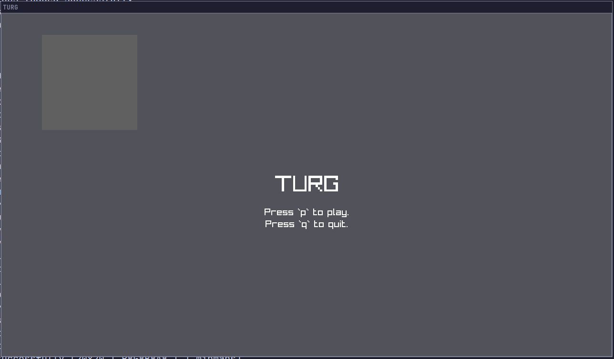
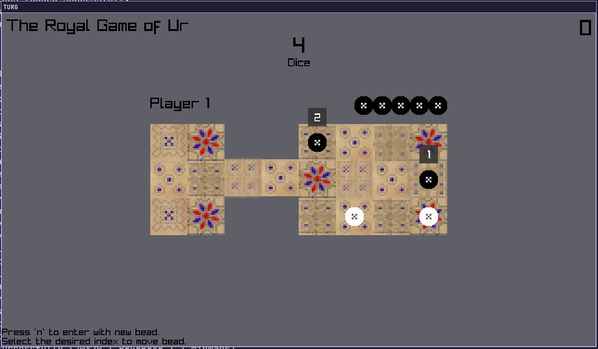
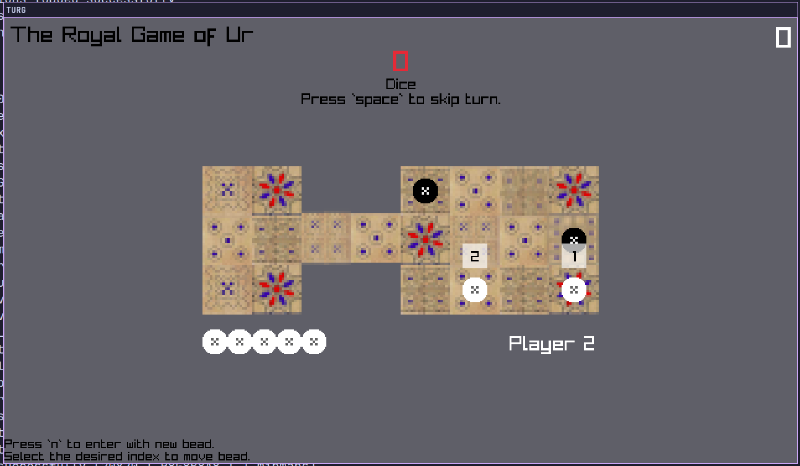

# TURG
just a simple `The Royal Game of Ur` written in C with `raylib`.

## SC
 





## BUILD

### Linux

```sh
gcc src/main.c -L ./raylib-5.0_linux_amd64/lib -l:libraylib.a -lm -o turg

```
### Windows (Not fully tested)
Compiling to windows platform need couple of change.

1. Change `srandom` and `random` to use `srand` and `rand`.
2. Use `mingw` to compile (don't use `msvc`).
3. Download the release for `raylib` windows .
4. use this sample comile command `gcc src/main.c -L ./raylib-5.0_win64_mingw-w64/ -l:raylib.dll -lm -o turg` (not tested yet).
5. Move the `raylib` dll file to the executeable dir.

## CONTROL
| Keys  | Function                        |
|-------|---------------------------------|
| n     | will put new beads at the board |
| 1..7  | will move the `n` beads         |
| r     | reset the game                  |
| i     | show beads info at the term     |
| space | skip turn                       |
